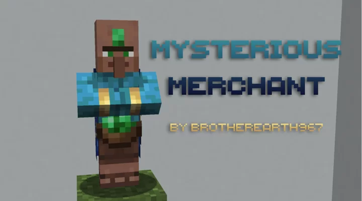

# Mysterious Merchant

During the development of 1.14, some designs were invented for the new travelling trader in the game. The first draft was a mysterious bejewelled villager with a blue robe and an emerald on its forehead. I really liked this design, so I re-created it pixel-by-pixel from the images we have been given for you to use in-game!

The only sources we have on this guy is on a [Minecraft.net blog post](https://www.minecraft.net/en-us/article/meet-wandering-trader).

## Licence
This work is licensed under a
[Creative Commons Attribution-NonCommercial-ShareAlike 4.0 International License](http://creativecommons.org/licenses/by-nc-sa/4.0/).

